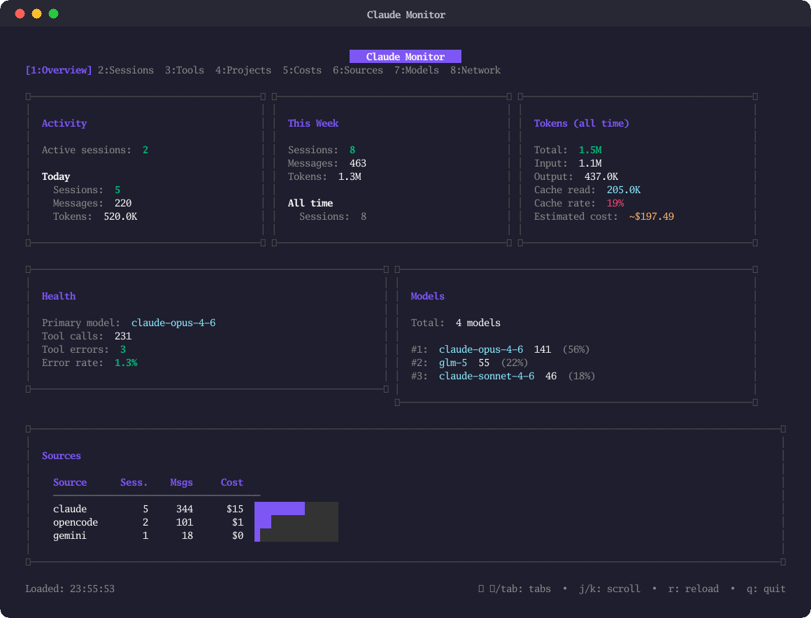
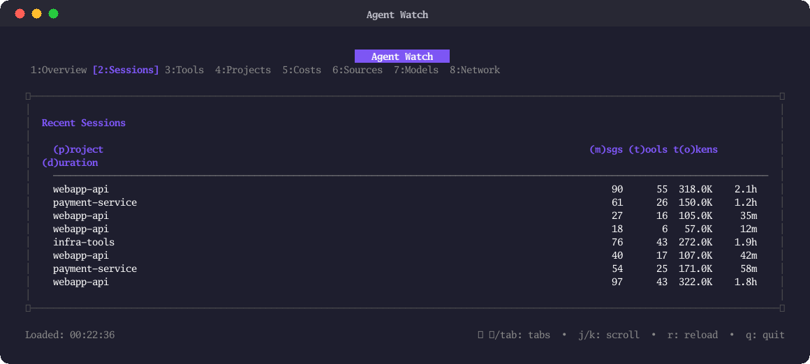
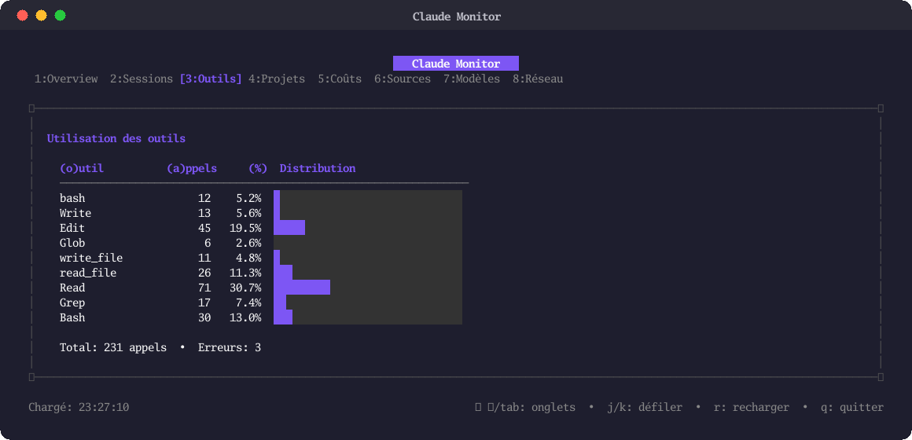
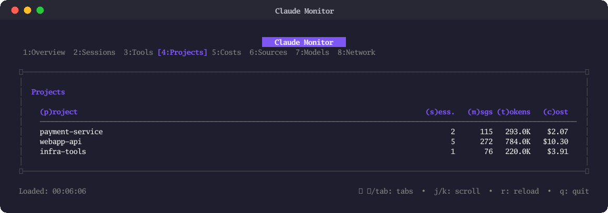
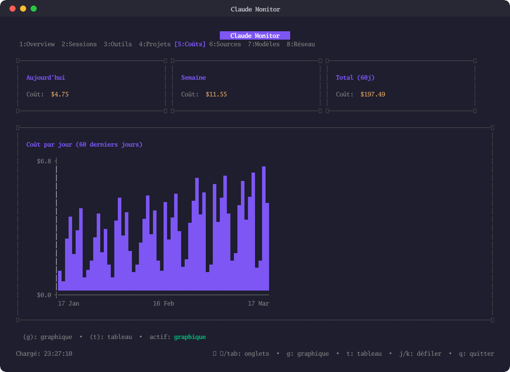
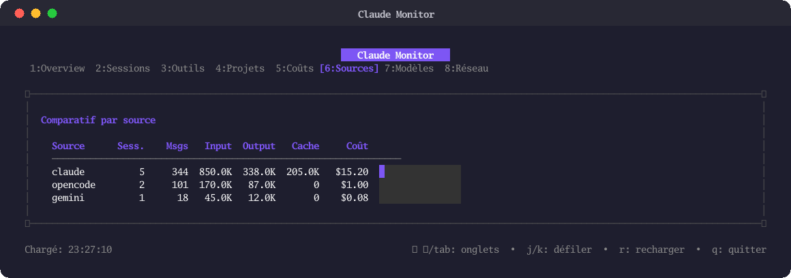
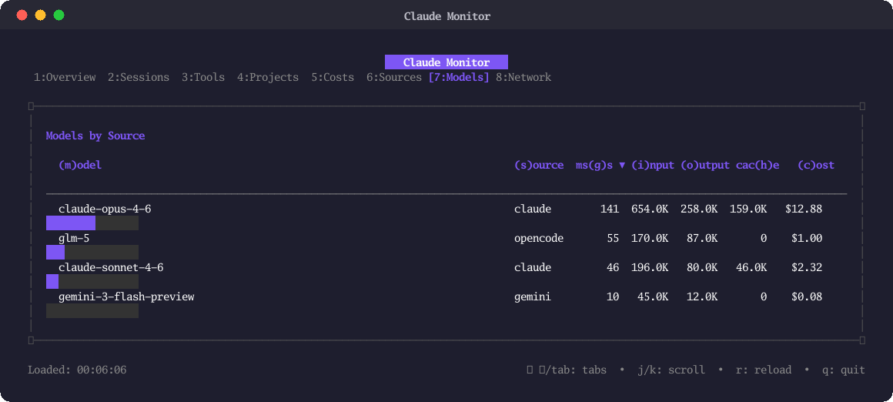
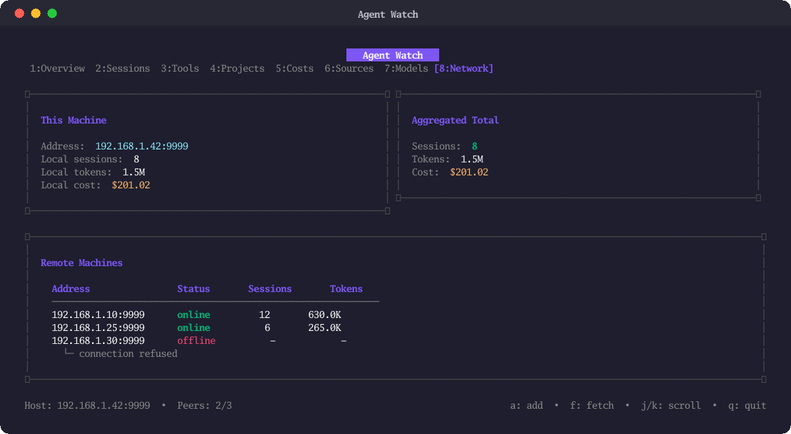

# Agent Watch

A terminal dashboard that aggregates token usage, costs, and session statistics across multiple AI coding assistants — **Claude Code**, **OpenCode (GLM)**, **Codex**, and **Gemini CLI**.



## Features

- **Multi-source aggregation** — Reads local data from Claude Code, OpenCode, Codex, and Gemini without any configuration
- **Real-time cost tracking** — Per-session, daily (60-day history), and total costs with model-specific pricing
- **8 interactive tabs** — Overview, Sessions, Tools, Projects, Costs, Sources, Models, Network
- **Distributed monitoring** — Built-in HTTP server + peer discovery to aggregate stats across machines
- **Cache-aware pricing** — Distinguishes input, output, cache read, and cache creation tokens

### 2. Sessions


### 3. Tools


### 4. Projects


### 5. Costs


### 6. Sources


### 7. Models


### 8. Network


## Installation

```bash
go install github.com/hadrienblanc/agent-watch@latest
```

Or build from source:

```bash
git clone https://github.com/hadrienblanc/agent-watch.git
cd agent-watch
go build -o agent-watch .
```

## Usage

```bash
agent-watch              # start on default port 9999
agent-watch -port 8080   # custom port for peer network
```

### Keyboard shortcuts

| Key | Action |
|-----|--------|
| `1`-`8` / `Tab` | Switch tabs |
| `j`/`k` | Scroll |
| `r` | Reload data |
| `q` | Quit |

Each tab has its own sort keys shown in the column headers (e.g. `p` for project, `m` for messages).

## Data sources

Agent Watch reads local data automatically — no API keys or configuration needed.

| Source | Location | Format |
|--------|----------|--------|
| **Claude Code** | `~/.claude/projects/` | JSONL conversations |
| **OpenCode** | `~/.local/share/opencode/opencode.db` | SQLite |
| **Codex** | `~/.codex/state_5.sqlite` | SQLite + JSONL |
| **Gemini CLI** | `~/.gemini/` | JSON sessions |

## Supported models

Pricing is built-in for 25+ models across providers:

- **Anthropic** — Claude Opus 4.6, Sonnet 4.6/4.5, Haiku 4.5/3.5
- **ZhipuAI** — GLM-5, GLM-4.7, GLM-4.5
- **MiniMax** — MiniMax-M2.5
- **OpenAI** — GPT-5.3-Codex, GPT-5.4, GPT-4.1, o3, o4-mini
- **Google** — Gemini 3 Flash, 2.5 Pro/Flash

Unknown models fall back to Opus pricing.

## Network monitoring

Agent Watch exposes a lightweight HTTP API and can aggregate stats from remote peers.

```
Machine A (192.168.1.10:9999) ──┐
Machine B (192.168.1.25:9999) ──┼── Your machine aggregates all
Machine C (192.168.1.30:9999) ──┘
```

**API endpoints:**

| Endpoint | Description |
|----------|-------------|
| `GET /api/stats` | Full statistics as JSON |
| `GET /api/health` | Health check |

Press `a` in the Network tab to add a peer, `f` to fetch.

## Regenerate screenshots

```bash
go run ./cmd/screenshot/
```

Generates PNGs in `screenshots/` with synthetic data for all 8 tabs.

## Tech stack

- [Bubble Tea v2](https://github.com/charmbracelet/bubbletea) + [Lipgloss v2](https://github.com/charmbracelet/lipgloss) for the TUI
- Go standard library `net/http` for the peer network
- [modernc.org/sqlite](https://pkg.go.dev/modernc.org/sqlite) for reading OpenCode/Codex databases (pure Go, no CGo)

## License

[MIT](MIT-LICENSE)
